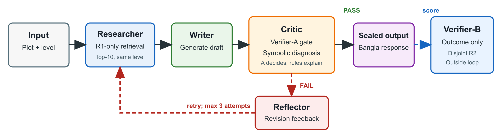

# III. Methodology

## A. Data and Target

The review corpus and film plots serve separate purposes: reviews define the control target, while plots provide generation inputs. Because reviews have no movie identifiers, generated responses are not treated as predictions of film-level audience behaviour.

The 5,000-row review corpus was audited to a frozen 4,625-row split surface [@b4]: Gold-300 contains 300 items, R1 contains 2,162, and R2 contains 2,163. Gold-300 never enters training, retrieval, prompting, or threshold selection. LaBSE-based diagnostics [@b3] did not support discrete audience personas. Two native-Bangla annotators instead tested a two-level engagement-specificity continuum through length-matched intrusion and direction judgments; the numerical evidence is reported with the results.

## B. Verifier-Isolated Framework

The framework uses four functional roles in a fixed loop, shown below. Researcher and Critic are deterministic tool roles; only Writer and Reflector call the generator.

| Component | Registered setting |
|---|---|
| Target | Level 0: general or formulaic; Level 1: engagement with a specific narrative detail |
| Construct data | Gold-300: human evaluation only; R1: Verifier-A and retrieval; R2: Verifier-B only |
| Retrieval | 886 Region-A R1 reviews; ten same-level LaBSE neighbours [@b8] |
| Acceptance | Frozen LaBSE logistic Verifier-A; maximum three Writer attempts |
| Diagnosis | Deterministic length, orthographic, connective, sentiment-marker, and lexical-richness rules |
| Outcome scoring | BanglaBERT Verifier-B [@b2], trained on 888 disjoint Region-A R2 reviews and applied only to sealed outputs |
| Trace | Retrieved IDs, drafts, scores, feedback, tokens, attempts, and stopping reason |

Verifier-A alone controls acceptance in the main neuro-symbolic condition; symbolic rules only localize revision feedback. Retrieved reviews provide style and specificity examples, not facts about the input plot. A common 20-word ceiling limits output length, but length diagnostics remain necessary because the generated levels are not length-neutral.

## C. Experimental Design

The frozen experiment crosses 90 held-out plots, two requested levels, ten conditions, and three paired seeds (42–44), producing 5,400 outputs. Every condition contributes 540 cases. Verifier-B target probability is the primary outcome. Each active condition is paired with zero-shot by plot, level, and seed. The analysis uses 10,000 paired-bootstrap resamples, 95% confidence intervals, McNemar tests, and Benjamini–Hochberg correction across the nine registered comparisons [@b49; @b50]. The seeds are pairing blocks, not independent studies. Three blinded native-Bangla annotators judged a separate balanced subset of 100 outputs. The planned tests compare active conditions with zero-shot; they do not rank the active systems.
