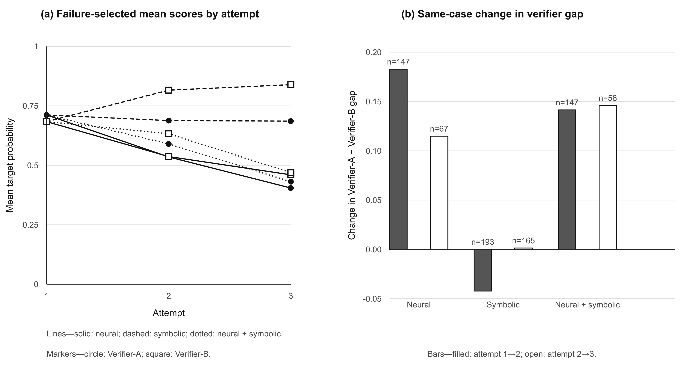

# IV. Results and Discussion

## A. Construct and Outcome Evidence

The full-corpus partition identified corpus region with 93.3% accuracy rather than revealing an audience taxonomy. Within the retained region, geometric tests did not support discrete natural groups. In length-matched four-way intrusion trials, two annotators selected the intended contrast in 39/50 and 42/50 cases against a 0.25 chance rate; both reached 34/40 on a separate direction task. The target is therefore interpreted as a two-level engagement-specificity continuum.

All 5,400 outputs received outcome-only Verifier-B scores. Each of the nine registered comparisons with zero-shot produced a positive target-probability effect whose 95% paired-bootstrap interval excluded zero after Benjamini–Hochberg correction. Neural gating with symbolic feedback produced the largest observed contrast (+0.2570, 95% CI [0.2151, 0.2987]), but its direct +0.02159 difference from neural-only gating is exploratory and does not establish hybrid superiority.

Performance was weaker at Level 0. Zero-shot accuracy was 0.3296 at Level 0 and 0.8074 at Level 1; neural gating with symbolic feedback raised these values to 0.7333 and 0.9593. Length remained entangled with the target. The symbolic-only gate exhausted its budget on 53.33% of Level-1 cases, supporting symbolic rules as diagnostics rather than an acceptance mechanism.

## B. Human Recognition and Proxy Divergence

Three annotators completed 300 judgments on a balanced 100-item subset. Pooled target-level accuracy was 0.9133 (95% CI [0.8667, 0.9567]), raw agreement was 0.88, and nominal Krippendorff's alpha was 0.8405. The result supports target-level recognition, not overall quality, plot faithfulness, or audience prediction.

The figure below shows the attempt trajectories and same-case gap changes. Among 147 neural-loop cases continuing from attempt 1 to 2, the Verifier-A–Verifier-B gap widened by 0.1828. It widened again by 0.1148 among 67 cases continuing to attempt 3. These failure-selected trajectories do not prove reward hacking in every revision, but they show why the in-loop verifier cannot supply its own final evidence.

## C. Scope and Limitations

The target comes from one short-review corpus with unresolved collection provenance and a strong source-region confound. Length, sentiment, and specificity are not fully separable. Verifier-B remains a proxy rather than human ground truth, and the three-person convenience sample cannot rank conditions. Human evaluation did not measure fluency, naturalness, hallucination, harmful content, or resemblance to real viewers. The English mirror remains incomplete.
