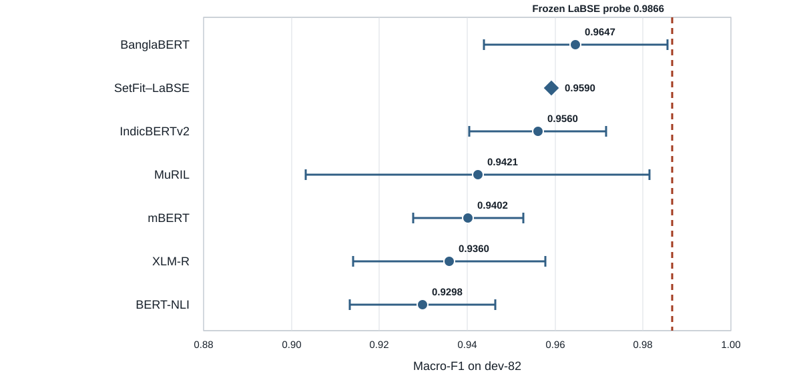

# Chapter 4 — Verifier Development and Isolation

The system uses two verifiers so that the model guiding revision does not also
determine the final result. Verifier-A guides generation; Verifier-B scores only
completed outputs. Both reproduce the operational levels developed in Chapter
3; human recognition is assessed separately.

## 4.1 Verifier Design and Data Separation

Verifier-A is the in-loop verifier. It scores drafts, supports acceptance decisions, and helps select among generated alternatives. Verifier-B is used only for final evaluation: it is excluded from retrieval, prompting, feedback, candidate selection, and regeneration. The final analysis tests whether gains against the in-loop scorer also appear under a model that did not influence generation. Cross-family evaluation has similarly been used to detect divergence between an optimised proxy and independent reference models [@b69].

The two verifiers also differ in their training data and model families. Verifier-A is trained on the labelled R1 partition, while Verifier-B is trained on the disjoint R2 partition. Both are evaluated on the same 82-item development slice so that their predictions can be compared on identical texts. Gold-300 is excluded from training, calibration, retrieval, prompting, and threshold selection. Table 4.1 summarises these data privileges.

**Table 4.1. Data available to each verifier**

| Component | Training partition | Level 0/1 | Evaluation partition | Role |
|---|---:|---:|---:|---|
| Backbone ablation | R1 training subset, *n* = 804 | 481/323 | dev-82 (53/29) | Compare the seven evaluated model configurations |
| Verifier-A | R1 training subset, *n* = 804 | 481/323 | dev-82 (53/29) | In-loop scoring and selection |
| Verifier-B | R2 Region-A subset, *n* = 888 | 531/357 | dev-82 (53/29) | Outcome-only evaluation |

*Note.* Dev-82 is the labelled Region-A portion of the 200-item R1 development subset and is excluded from the 804 Verifier-A training items. R2 is disjoint from R1. Gold-300 is not used in any experiment reported in this chapter.

The development slice is held out from both verifier-training sets, but it serves several purposes: learning-rate selection in the ablation, temperature fitting, and the evaluation reported in this chapter. The reported scores are development-set estimates, not independent final-test performance.

## 4.2 Backbone Results and Construction Circularity

Seven model configurations were evaluated because earlier Bangla classification studies do not identify a consistent leading backbone. MuRIL, XLM-R, and IndicBERTv2 have each been reported as the strongest model in related Bangla tasks [@b26; @b27; @b28]. Evidence that fine-tuned small models can outperform zero-shot generative classifiers also supports using a trained discriminative verifier for this task [@b52]. The comparison included Bangla-specific, Indic, multilingual, contrastive, and entailment-based alternatives. The five conventional fine-tuning models used four epochs, batch size 16, a maximum sequence length of 128, two learning rates (2 × 10⁻⁵ and 3 × 10⁻⁵), and seeds 42–46. SetFit–LaBSE and BERT-NLI followed their respective training procedures [@b51; @b61].

Macro-F1 was used because the two levels are imbalanced. Variation across seeds is reported as sensitivity rather than as an inferential decision rule [@b46; @b47; @b48]. The registered comparison used paired bootstrap tests with 10,000 resamples and Benjamini–Hochberg correction across all 21 model pairs [@b49; @b50]. Table 4.2 reports the model results together with the diagnostic baselines used to interpret them.

**Table 4.2. Model and baseline performance on dev-82**

| Model or baseline | Mean macro-F1 | Seed SD | Selected learning rate |
|---|---:|---:|---:|
| **Evaluated models** |  |  |  |
| BanglaBERT | 0.9647 | 0.0209 | 3 × 10⁻⁵ |
| SetFit–LaBSE | 0.9590 | Not estimable | Not applicable |
| IndicBERTv2 | 0.9560 | 0.0156 | 3 × 10⁻⁵ |
| MuRIL | 0.9421 | 0.0391 | 3 × 10⁻⁵ |
| mBERT | 0.9402 | 0.0125 | 2 × 10⁻⁵ |
| XLM-R | 0.9360 | 0.0219 | 3 × 10⁻⁵ |
| BERT-NLI | 0.9298 | 0.0165 | 3 × 10⁻⁵ |
| **Diagnostic baselines** |  |  |  |
| Majority classifier | 0.3926 | — | — |
| Length rule | 0.6197 | — | — |
| Frozen LaBSE with logistic regression | **0.9866** | — | Fixed defaults |

*Note.* For the evaluated models, the mean and standard deviation are calculated across five seeds at the selected learning rate. The diagnostic baselines were not included in the 21 corrected pairwise comparisons. SetFit–LaBSE produced only one distinct prediction vector; its seed variability could therefore not be estimated. BanglaBERT was retained using the predetermined non-performance tie-break. The reported scores measure agreement with the operational labels rather than with independently assigned human labels.

None of the 21 pairwise comparisons remained significant after correction; the smallest unadjusted *p*-value was 0.0960. A robustness analysis pooling both learning rates produced the same result. BanglaBERT was retained using the predetermined non-performance tie-break, not because the experiment established its superiority.

### 4.2.1 Construction Circularity

The frozen LaBSE probe changed how the backbone results had to be read. Chapter 3 formed the two operational levels by applying K-means to LaBSE embeddings. A linear classifier trained on those same embeddings reached 0.9866 macro-F1, exceeding the highest fine-tuned mean of 0.9647. Figure 4.1 places this baseline beside the seven evaluated models.

*Figure 4.1. Backbone performance and the frozen-LaBSE baseline on dev-82. Whiskers show ±1 seed SD; no variability estimate is available for SetFit–LaBSE.*

The label is almost linearly recoverable from the representation used to construct it. For that reason, the ablation cannot support a claim about general backbone quality. Its near-ceiling scores show label reproduction, not independent validation of the construct, and the tie should be understood in that context.

The length-only rule reached 0.6197, compared with 0.3926 for the majority classifier. Length is consequently part of the operational distinction, although Chapter 3's residual and human-validation analyses show that it does not explain the distinction completely. In particular, annotators recovered the intended direction in length-matched comparisons without access to either verifier.

This circularity matters when Verifier-A is placed inside the generation loop. A generator may raise its score by moving text toward the preferred region of LaBSE space without producing an improvement that transfers to another evaluator. Verifier-B uses a different model family and different training data, and it is applied only after generation.

## 4.3 Final Verifier Configurations

### 4.3.1 Verifier-A

Verifier-A combines the frozen `sentence-transformers/LaBSE` encoder [@b3] with an L2-regularised logistic-regression head trained on 804 R1 items. The embeddings are L2-normalised, and the classifier uses fixed library settings rather than development-score-based hyperparameter selection. On dev-82, it reproduced the circularity baseline exactly: macro-F1 was 0.9866, with one Level-1 item classified as Level 0.

The model is inexpensive enough for repeated calls during generation, but its high score should be interpreted narrowly. It shows that the operational boundary can be recovered from its originating embedding space. It does not establish human-ground-truth validity, and the same geometric relationship that makes the model accurate may also make it vulnerable to optimisation against its score.

### 4.3.2 Verifier-B

Verifier-B is a BanglaBERT model [@b2] trained from scratch on the 888 labelled R2 items using the same four-epoch setup evaluated in the backbone comparison. It uses a fixed learning rate of 2 × 10⁻⁵. The learning rate was not selected on dev-82, avoiding another validation-based choice on an already small and repeatedly used slice; recent evidence also shows that validation-optimal hyperparameters do not always transfer better than defaults in small holdout settings [@b82]. The final model uses seed 42, which was fixed before training rather than chosen from the best of five runs.

The stored model reached 0.9597 macro-F1 on dev-82, making three errors. Across seeds 42–46, the mean was 0.9674 with a standard deviation of 0.0158 and a range from 0.9448 to 0.9866. This range is a sensitivity result, not evidence for comparing Verifier-B with Verifier-A. The models use different training partitions and architectures, and dev-82 is too small and too heavily reused to support a ranking. Table 4.3 summarizes their assigned roles, training data, model designs, and development results.

**Table 4.3. Roles and data boundaries of the final verifiers**

| Dimension | Verifier-A | Verifier-B |
|---|---|---|
| Function | In-loop scoring and candidate selection | Outcome-only evaluation |
| Training data | R1, *n* = 804 (481/323) | R2, *n* = 888 (531/357) |
| Model | Frozen LaBSE + logistic regression | Fine-tuned BanglaBERT |
| Development macro-F1 | 0.9866 (1 error) | 0.9597 (3 errors; seed 42) |
| Seed sensitivity | Deterministic fit | 0.9674 ± 0.0158 across five seeds |
| Access during generation | Permitted | Prohibited |

*Note.* Both scores are calculated on the same dev-82 items. The table describes the two verifiers in their assigned roles; it does not rank them.

Figure 4.2 shows the error distribution on the shared development items. Verifier-A made one false negative. Verifier-B made one false positive and two false negatives. The reference labels are the operational labels from Chapter 3 rather than independent human-gold judgements.

*Figure 4.2. Confusion matrices on dev-82. Percentages are conditional on the operational reference label.*

## 4.4 Probability Calibration

Temperature scaling was fitted separately for each verifier [@b53]. Logistic regression was not assumed to be calibrated merely because it performed well as a classifier; frozen-encoder studies report that a head can rank highly in accuracy while remaining weaker on calibration measures [@b83]. A single-parameter method was preferred because more flexible calibrators can become unreliable when the calibration sample is small [@b54]. Five bins were used for expected calibration error (ECE), and bootstrap intervals were calculated for the reduction in ECE. Since temperature fitting and assessment use the same 82 items, the results remain descriptive. Table 4.4 reports the fitted temperatures and the before-and-after calibration measures.

**Table 4.4. Calibration results on dev-82**

| Verifier | Temperature | Metric | Before | After | Interpretation |
|---|---:|---|---:|---:|---|
| Verifier-A | 0.1092 | ECE | 0.1184 | 0.0054 | Reduction 0.1130; 95% CI [0.0743, 0.1349] |
|  |  | Brier score | 0.0306 | 0.0093 | Descriptive reduction |
|  |  | Negative log-likelihood | 0.1515 | 0.0282 | Descriptive reduction |
| Verifier-B | 1.0995 | ECE | 0.0164 | 0.0100 | Reduction 0.0065; 95% CI [−0.0066, 0.0070] |
|  |  | Brier score | 0.0278 | 0.0273 | Descriptive reduction |
|  |  | Negative log-likelihood | 0.1101 | 0.1088 | Descriptive reduction |

*Note.* Temperature fitting and evaluation use the same 82-item development slice. The confidence interval refers to the reduction in ECE. Calibration improvement is supported for Verifier-A on this slice but is not established for Verifier-B.

Verifier-A's temperature is below one, sharpening probabilities that were underconfident on this slice. Its ECE reduction is supported by the bootstrap interval. Verifier-B required only mild softening, and its interval includes zero; calibration improvement could not be established for that model. Later chapters treat Verifier-B scores as fixed model outputs rather than as probabilities with demonstrated out-of-sample calibration.

## 4.5 Isolation, Reproducibility, and Limits

The separation between the verifiers is enforced at several points. R1 and R2 identifiers are checked for overlap, both training sets are checked against dev-82 and Gold-300, and Verifier-B's configuration records its outcome-only role. Static checks prevent generation modules from importing Verifier-B, while generation records are rejected if they contain a Verifier-B score. These controls preserve the central comparison: both models evaluate the same generated texts, but only Verifier-A can affect how those texts are produced.

The shared development set does not weaken the training-data separation. None of its 82 items appears in either verifier's training data. Its use for both models is necessary for a like-for-like descriptive comparison, although its repeated use limits generalisation claims.

Dev-82 is held out from training but reused for model selection, calibration, and reporting, so it is not an independent final test set. The operational labels come from LaBSE geometry rather than human-gold verifier labels. The SetFit implementation did not produce effective seed or learning-rate variation, and calibration was fitted and assessed on only 82 items. Calibration improved for Verifier-A on this slice, but the corresponding improvement was not established for Verifier-B. The chapter therefore makes no claim about general backbone superiority, human-ground-truth accuracy, or out-of-sample calibration.

## 4.6 Chapter Summary

Verifier-A reproduces the LaBSE-derived boundary from R1 and guides generation;
Verifier-B learns from disjoint R2 data and scores only sealed outputs. The
ablation did not identify a superior backbone, while the near-perfect frozen
LaBSE probe exposed construction circularity. Chapter 5 therefore uses
Verifier-A for control and preserves Verifier-B for outcome evaluation.
