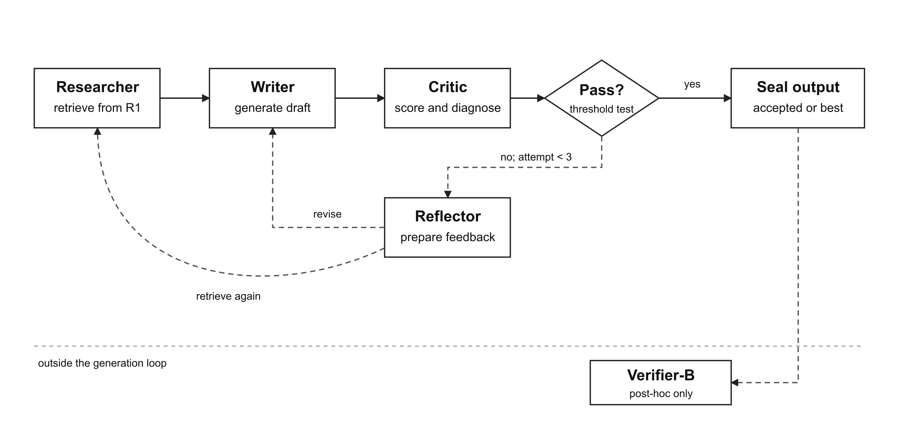
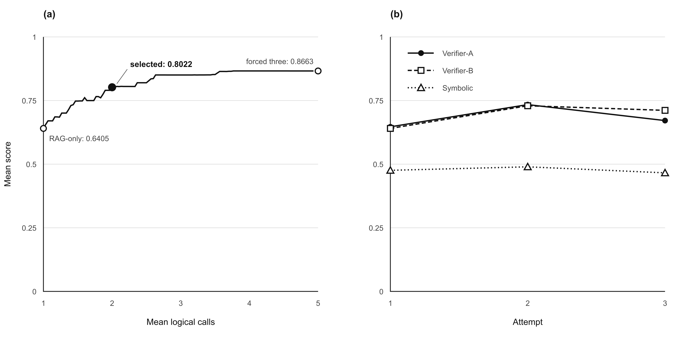

# Chapter 5 — Bounded Neuro-Symbolic Workflow

This chapter turns the engagement-specificity levels and verifier roles into a
bounded generation workflow. The Researcher retrieves examples, the Writer
drafts a response, the Critic evaluates it, and the Reflector prepares feedback.
Transitions, retries, data access, and scoring privileges are fixed before
generation.

## 5.1 Roles and State

### 5.1.1 Functional Roles

The term *multi-agent* refers here to functional decomposition and message passing, not to four autonomous or independently trained models. Within the proposed four-role workflow, only the Writer and Reflector make generative-model calls. The Researcher performs deterministic retrieval, while the Critic applies fixed local scoring functions. Table 5.1 summarizes the information and privileges assigned to each role.

**Table 5.1. Roles, inputs, outputs, and model access**

| Role | Main function | Inputs | Output | Generative-model call | Verifier-B access |
|---|---|---|---|---:|---:|
| Researcher | Retrieve ten same-level R1 examples | Plot, target level and optional failed-feature terms | Ranked exemplars | No | No |
| Writer | Produce or revise the Bangla response | Plot, level definition, exemplars and available feedback | Candidate response | Yes | No |
| Critic | Apply the acceptance gate and symbolic diagnostics | Candidate response and target level | Gate result and named failures | No | No |
| Reflector | Convert a failed evaluation into a bounded correction brief | Draft, target level and permitted diagnostic information | Feedback for the next attempt | Yes | No |

Verifier-A is available to the Critic because it controls acceptance in the neural-loop conditions. Verifier-B is absent from every role and is applied only after an output has been sealed. This separation makes it possible to test later whether improvement against the in-loop verifier transfers to an evaluator that did not influence generation.

Figure 5.1 shows the fixed routing. A passing response is emitted immediately. A failed response may be revised until the three-attempt limit is reached. If no attempt passes, the response with the highest gate score is emitted and the trace records that the attempt budget was exhausted.



*Figure 5.1. Bounded generation workflow and post-hoc Verifier-B evaluation.*

### 5.1.2 Shared State and Trace

For plot \(p\), requested level \(l\), and attempt \(t\), the controller state is

\[
s_t=(p,l,E_t,y_t,a_t,r_t,f_t,c_t),
\]

where \(E_t\) is the retrieved evidence, \(y_t\) the current draft, \(a_t\) the Verifier-A score, \(r_t\) the symbolic diagnostics, \(f_t\) the feedback available to the next attempt, and \(c_t\) the accumulated logical cost. Verifier-B is not part of this state because no generation decision may consult it.

Each attempt is written as a new trace record before the controller advances. The record contains the retrieved identifiers, generated response, scores, gate decision and feedback associated with that attempt. The previous draft and feedback are passed explicitly to the next Writer call, which distinguishes revision from independent resampling.

The controller can retrieve, generate, evaluate, request feedback, retry, accept, or emit the best available response when the attempt limit is reached. It cannot change the threshold, increase the retry limit, alter its data access, select new tools, or change the experimental condition. The framework is therefore an evaluator–optimizer workflow with predefined control flow rather than an autonomous agent that plans its own trajectory.

## 5.2 Generation and Retrieval

### 5.2.1 Bounded Generation Loop

Algorithm 5.1 gives the common loop used by the retrieval-based verifier conditions. The gate may use the neural or symbolic score depending on the experimental condition. Named symbolic failures are supplied to the Reflector only when symbolic feedback is enabled.

```text
Algorithm 5.1  Bounded verifier-guided generation

Input: plot p, target level l, gate threshold tau,
       gate type g, symbolic-feedback flag h
Constants: maximum attempts T = 3; retrieved examples k = 10

1. Set attempt t = 1; feedback = empty; candidates = empty.
2. Set the plot as the retrieval query anchor. After a failed attempt, add the
   failed-feature terms when h is enabled.
3. Retrieve k R1 examples from the requested level.
4. Generate a response from the plot, level definition, examples and feedback.
5. Compute the Verifier-A score and symbolic diagnostics.
6. Use the score specified by g as the gate value; store the candidate and trace.
7. If the gate value reaches tau, emit the current response.
8. If t = T, emit the candidate with the highest gate value and record exhaustion.
9. Otherwise, produce bounded feedback, increment t and return to step 2.
```

Writer generation and non-terminal reflection are the only generative-model calls. A response accepted on its first attempt costs one logical call. A second attempt costs three calls: two Writer calls and one Reflector call. Reaching the third attempt costs five calls. No Reflector call is made after the final attempt because no later Writer call could use its feedback. If several attempts share the highest gate value, the earliest is emitted.

### 5.2.2 Retrieval and Prompt Construction

The retrieval index contains 886 Region-A reviews from R1: 534 at Level 0 and 352 at Level 1. The reviews are represented with L2-normalized LaBSE embeddings, allowing inner-product search to operate as cosine similarity [@b8]. The index contains no R2 or Gold-300 identifiers. Its membership is checked against the frozen split before the vectors are stored.

Each request retrieves the ten nearest examples from the requested level. The level restriction is applied within the query rather than after retrieval, ensuring that every retrieval-conditioned prompt receives ten examples. The plot remains the query anchor on every attempt. When symbolic feedback is enabled, failed-feature terms augment the plot query but never replace it.

All experimental conditions use the same prompt renderer. Zero-shot generation omits examples and feedback; retrieval conditions add examples; revision conditions add the feedback permitted by their treatment. This shared renderer prevents differences in task wording from being mistaken for effects of retrieval or verification. Bangla text is preserved without transliteration or stemming, and no language model is fine-tuned.

Both requested levels use a 20-word output ceiling. The common ceiling reduces the length difference observed during construct development but does not remove it: on the length-controlled development generations, word count alone recovers the requested level with AUC 0.9111. Length diagnostics therefore accompany the later results, and the framework does not claim length-neutral control [@b81].

## 5.3 Neural Gating and Symbolic Diagnosis

### 5.3.1 Separation of Decision and Feedback

Verifier-A supplies the primary acceptance score. The symbolic component evaluates eleven interpretable features and identifies which checks fail. This external diagnostic signal is used because self-correction without external feedback can leave errors unchanged or make a response worse [@b5; @b6]. The symbolic features help specify what should be reconsidered; they are not treated as ground truth.

Whether the symbolic score should also contribute to acceptance was evaluated on the development generations. A combined score \(g=wa+(1-w)r\) was tested over 21 values of \(w\), where \(a\) is the Verifier-A score and \(r\) the symbolic score. Every plot-grouped validation fold selected \(w=1\), corresponding to neural-only gating. At the same time, changing \(w\) altered the pass/fail decision for many responses. The symbolic component therefore affected decisions without improving held-out discrimination.

**Table 5.2. Neural and symbolic signals on development outputs**

| Condition | Symbolic AUC | Neural AUC | Length AUC | Decisions changed | Held-out result |
|---|---:|---:|---:|---:|---|
| Length-controlled | 0.3417 | 0.8333 | 0.9111 | 50.8% | Neural-only selected in all five folds; mean ΔAUC = 0.0000 |
| Free-length | 0.0656 | 0.8658 | 0.9894 | 39.2% | Neural-only selected in all five folds; mean ΔAUC = 0.0000 |

*Note.* The requested level is the binary label for all AUC values. The table measures agreement with the generation instruction, not human validation of generated responses.

The symbolic scorer itself reached macro-F1 0.5150 under stratified five-fold cross-validation, compared with 0.6570 when assessed on the same 82 rows used for fitting. This gap, together with the weight study in Table 5.2, does not support symbolic adjudication. The primary loop therefore uses Verifier-A for acceptance and retains symbolic features for diagnostic feedback. A separate symbolic-loop condition remains in the experiment as a control, using a threshold of 0.1816651 chosen to reproduce the neural gate's 39/60 first-attempt acceptance count on the development cases.

### 5.3.2 Acceptance Threshold and Retry Limit

The Verifier-A threshold was selected on 60 development plot-level cases. Each case had a forced three-attempt trace, allowing every possible stopping threshold to be reconstructed without generating new responses. Candidate thresholds were the observed Verifier-A scores rather than an arbitrary uniform grid.

The selection objective follows calibrated cost-aware routing by balancing
outcome quality and logical cost [@b88]:

\[
\tau^{*}=\arg\max_{\tau}
\frac{Q_B(\tau)-\alpha_{\mathrm{lo}}}
{\mathbb{E}[\mathrm{calls}\mid\tau]},
\]

where \(Q_B(\tau)\) is measured by Verifier-B after the forced traces were generated. The one-call retrieval endpoint defines \(\alpha_{\mathrm{lo}}=0.640501\), while forced generation of all three attempts defines the higher-cost reference \(\alpha_{\mathrm{hi}}=0.866272\). Verifier-B evaluates the reconstructed policies but never supplies a score during generation.

**Table 5.3. Development operating points for threshold selection**

| Quantity | One-call retrieval | Selected policy, \(\tau^{*}=0.4384071\) | Forced three attempts |
|---|---:|---:|---:|
| Verifier-B outcome score | 0.640501 | **0.802219** | 0.866272 |
| Mean logical calls | 1.000 | **2.000** | 5.000 |
| First-attempt acceptance | 1.000 | **0.650** | Not applicable |
| Final acceptance | 1.000 | **0.867** | Not applicable |
| Exhausted cases | 0 | **8/60** | Not applicable |
| Mean emitted-attempt index | 1.000 | **1.367** | 1.867 |

*Note.* The forced-three condition ignores the stopping decision and generates all three drafts. It defines the high-cost reference rather than a candidate stopping policy.

The selected threshold captures 71.63% of the Verifier-B gain between the one-call and forced-three endpoints while using an average of two logical calls. Under this policy, 39 cases stop after the first attempt, 12 after the second and one after the third; eight reach the ceiling without passing. The same threshold is used for both requested levels. A permutation test did not detect a difference in attempt-one gate scores between the two levels (\(p=0.4687\)), but this does not establish equal difficulty.

Figure 5.2 shows the quality–cost frontier and the forced-attempt score pattern. The first revision improves the mean Verifier-A and Verifier-B scores by 0.0872 and 0.0890. The second revision reduces them by 0.0627 and 0.0180, respectively. These paired development traces support a bounded retry policy but cannot show whether a fourth attempt would help.



*Figure 5.2. Development quality–cost frontier and forced-attempt score trajectories.*

The eight exhausted development cases form a complete census at the selected threshold. One response was off-topic, two required an additional category not included in the predefined taxonomy, and five showed no observable error covered by that taxonomy. The cases were coded once and reviewed by the researcher; no independent second coding was performed. This small, single-coded census is descriptive and does not estimate failure prevalence.

## 5.4 Experimental Conditions

The main experiment contains ten conditions produced through the same prompt renderer and data-access rules. Table 5.4 specifies the evidence, decision signal and revision mechanism for each condition. It also makes explicit that Verifier-B is unavailable throughout generation.

**Table 5.4. The ten experimental conditions**

| Condition | Evidence | Decision signal | Revision or selection | Max. calls |
|---|---|---|---|---:|
| Zero-shot | None | None | First draft emitted | 1 |
| Static few-shot | Ten deterministically randomized same-level R1 examples | None | First draft emitted | 1 |
| RAG-only | Top-10 same-level R1 retrieval | None | First draft emitted | 1 |
| RAG + neural loop | Top-10 same-level R1 retrieval | Verifier-A, \(\tau=0.4384071\) | Generic bounded feedback and re-retrieval | 5 |
| RAG + symbolic loop | Top-10 same-level R1 retrieval | Symbolic score, \(\tau=0.1816651\) | Named failures and query augmentation | 5 |
| RAG + neural gate and symbolic feedback | Top-10 same-level R1 retrieval | Verifier-A, \(\tau=0.4384071\) | Neural result, named failures and query augmentation | 5 |
| Intrinsic self-critique | Top-10 same-level R1 retrieval | Model-generated critique | Critique placed in the assistant role | 3 |
| External-role self-critique | Top-10 same-level R1 retrieval | Model-generated critique | Same critique placed in the user role | 3 |
| Hosted-judge loop | Top-10 same-level R1 retrieval | Judge PASS/FAIL and target-fit score | Bounded judge feedback | 6 |
| Blind resampling | Top-10 same-level R1 retrieval | Verifier-A ranking within a matched token budget | Independent candidates; no revision | Up to 5 |

*Note.* A model call includes Writer, Reflector, self-critique or judge calls as applicable. Verifier-A and deterministic symbolic scoring are local operations and are not counted as generative-model calls. Verifier-B has no access to any condition during generation.

The two self-critique conditions use the same critique text and differ only in message role. A digest check confirms that the critique bytes match before the pair is accepted. This contrast tests whether placement of feedback in the conversation changes the apparent self-correction effect [@b13; @b14].

The hosted judge is `gemma-4-26b-a4b-it`, accessed through the provider's interaction interface with seed 42, high reasoning effort and a 512-token output limit. It sees the plot, requested level, draft and evaluation rubric, but no Verifier-A or Verifier-B score. It is a hosted same-family control, not an independent outcome evaluator.

The eight retrieval-based conditions from RAG-only through blind resampling share the same initial retrieval-conditioned response for each plot–level–replicate key. This pairing removes irrelevant first-draft variation while each condition retains its own subsequent calls and cost.

### 5.4.1 Matched-Budget Blind Resampling

Blind resampling separates the benefit of revision from the benefit of spending more generation budget. Five independent retrieval-conditioned responses are generated in a fixed order. For each case, only the largest prefix whose cumulative model-token count fits within the realized token cost of the neural-gate/symbolic-feedback loop is eligible for selection. Verifier-A then selects the highest-scoring response within that prefix.

The eligible set is always a prefix in generation order; candidates cannot be chosen after their scores are observed. The budget includes prompt and completion tokens from Writer and Reflector calls under the same generator. It is a model-token comparison rather than a claim of equal hardware FLOPs, latency or functional computation. If the loop budget cannot fund even one candidate, the matching procedure raises an error instead of silently falling back to an unmatched result. This control follows verifier-ranked sampling [@b58] while addressing evidence that refinement and resampling advantages can change when compute is matched [@b16; @b17].

## 5.5 Execution, Reproducibility, and Limits

The Writer is `google/gemma-3-12b-it`, loaded locally with 4-bit NormalFloat quantization. Generation uses a maximum of 80 new tokens, temperature 0.8 and top-p 0.9 under the common 20-word instruction. Every evaluation plot, requested level and condition is crossed with seeds 42, 43 and 44. The resulting design contains 90 plots × 2 levels × 10 conditions × 3 paired seeds, or 5,400 Bangla cases. The seeds are paired sensitivity blocks rather than independent experimental replications.

Before generation begins, the runner checks the 90-plot set, R1-only retrieval manifest, condition list, expected case keys and Verifier-B exclusion. Each completed case records its plot identifier, requested level, condition, seed, attempt count, emitted response, logical calls, token use, stopping status and attempt trace. Checkpoints are append-only, and each case key may occur only once. Verifier-B scoring runs later as a separate process and joins to the sealed outputs by case key.

The live demonstration interface is separate from the frozen experiment. It uses hosted services and an additional operational support check, does not write user plots to the repository, and contributes no evidence to the thesis results.

The threshold and symbolic-weight analyses use development generations rather than the final evaluation surface. The forced traces contain three drafts for every development case; their attempt-to-attempt changes do not describe only the cases that would continue under the selected policy, and they cannot establish an optimal retry ceiling beyond three attempts.

The review corpus has no movie identifier, so retrieval supplies level-matched language examples rather than audience evidence about the film named in the prompt. Requested level remains strongly recoverable from response length despite the common word ceiling. The symbolic scorer is trained on only 82 labelled rows and does not improve held-out discrimination when combined with Verifier-A. Its role is therefore limited to diagnosis. The failure census contains only eight single-coded cases, and the blind-resampling control matches realized model tokens rather than hardware computation.

## 5.6 Chapter Summary

The bounded workflow retrieves only from R1, uses Verifier-A for acceptance, and
keeps Verifier-B outside generation. Symbolic checks name problems but do not
control the primary gate because they added no held-out discrimination. The
selected threshold balances development-set outcome quality against logical
calls. Chapter 6 compares this workflow with the nine registered alternatives
on the frozen 5,400-case surface.
