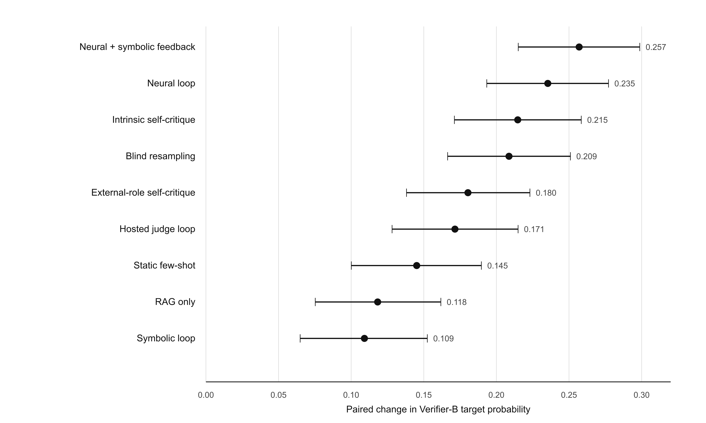
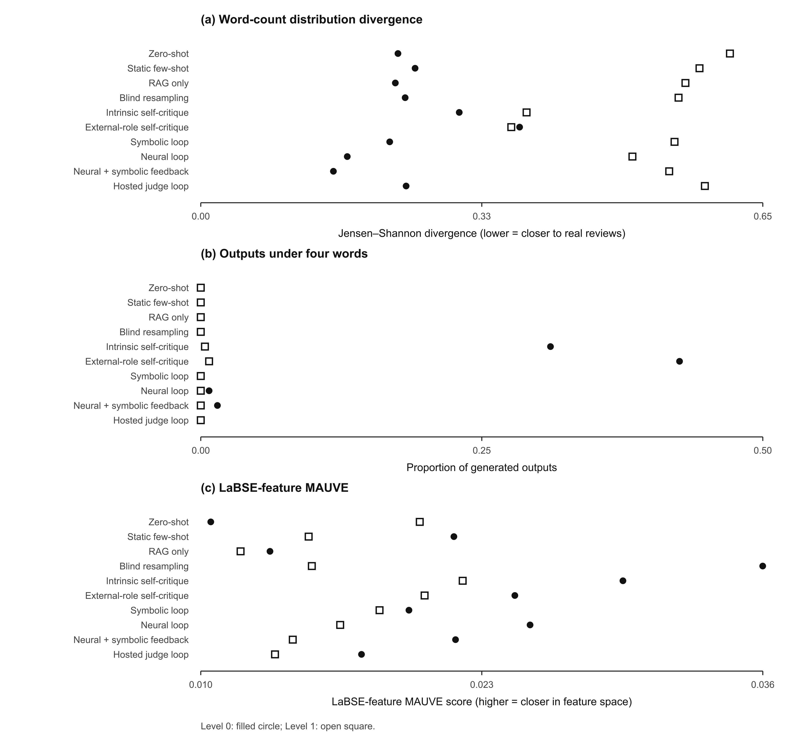
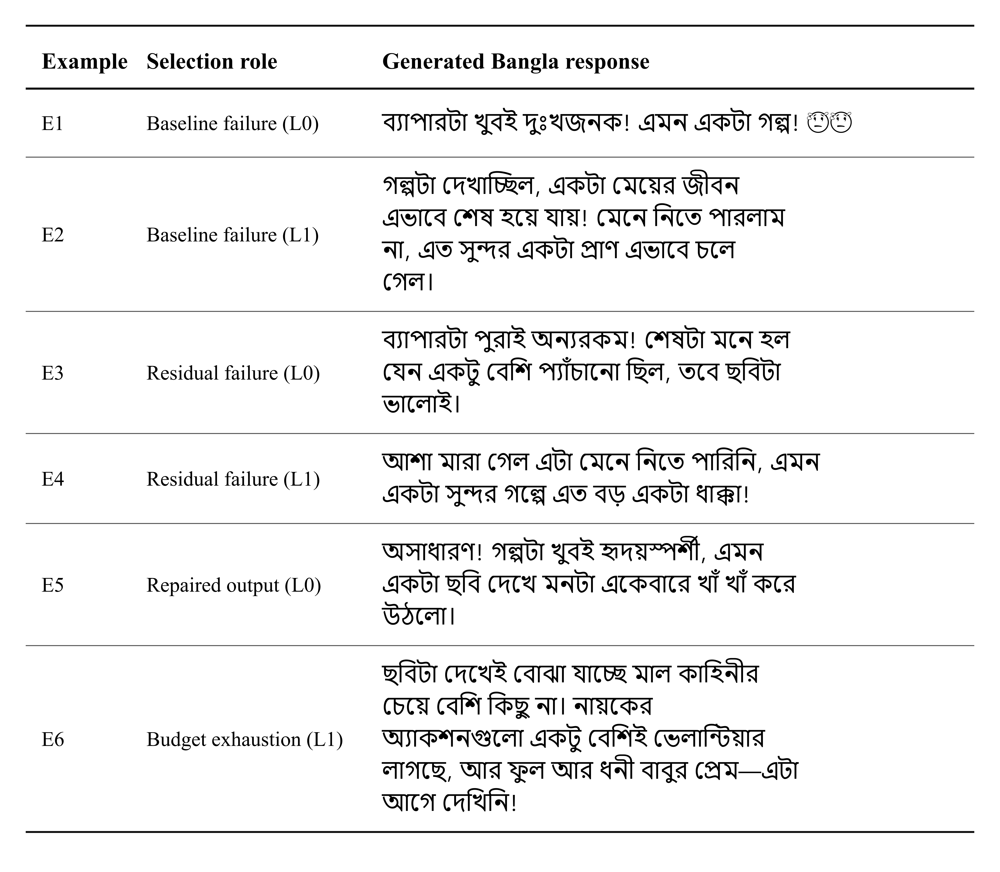

# Chapter 6 — Results and Analysis

This chapter reports the Bangla generation results, including target-level
performance, cost, verifier divergence, human judgments and error cases.

## 6.1 Design and Statistical Tests

The experiment tests whether short Bangla cinema responses can be generated at
a requested engagement-specificity level. Level 0 is a general or formulaic
reaction; Level 1 refers to a specific event or construction element. This is a
control task, not audience prediction. The corpus has no film identifier, so the
outputs cannot be matched to reactions written about the same film.

The evaluation set contains 90 held-out plot synopses, two requested levels,
ten conditions and three generation seeds (42, 43 and 44), giving 5,400 outputs.
Each condition contributes 540 outputs, divided equally between the two levels.
The seeds serve as paired blocks rather than independent experiments, and no
best seed is selected. Chapter 5 describes the generation settings and the ten
conditions.

Table 5.4 defines the ten conditions. Retrieval uses only R1. Verifier-A may
guide the registered loops and blind-resampling selector, whereas Verifier-B is
sealed from generation and used only for outcome scoring. This separation is
needed for the divergence analysis in Section 6.5.

The primary outcome is Verifier-B target probability $p_B(l \mid y)$; binary
target match uses its fixed 0.5 decision point. Cost, exhaustion, diversity,
length, feature-space similarity and blinded human judgments are reported
separately.

The primary statistical family contains exactly nine paired comparisons, each
active condition against zero-shot. Cases are paired by plot, requested level and
generation seed. Uncertainty for the continuous outcome is estimated with 10,000
paired bootstrap resamples, following paired significance-testing guidance for
NLP [@b49]. Binary target match is checked with McNemar's test, and the
nine-comparison family is corrected with the Benjamini–Hochberg procedure [@b50].
The design supports comparisons with zero-shot, not a ranking among active
conditions. The three seeds are paired blocks, not candidates for selection.

The neural-plus-symbolic versus neural-only contrast in Section 6.4 and the
same-item human comparison in Section 6.6 are post-hoc and exploratory.
Verifier-B scores on all 5,400 outputs remain the primary analysis.

### 6.1.1 Run Completeness

The final dataset contains exactly 5,400 unique case keys. There are no missing,
extra, or duplicate cases, and all 5,400 outputs received a separate Verifier-B
score. The run used 7,068 local generation calls and 654 hosted judge calls.
Verifier-B is absent from every generation record. These checks establish
completeness and isolation, not model quality.

Every analysis in this chapter uses this fixed dataset. The exploratory
comparisons and qualitative examples neither rerun generation nor rescore the
responses.

## 6.2 Results Across Conditions

Table 6.1 reports all 20 condition-level cells, with 270 outputs per row.
Verifier-B supplies both outcome columns. Calls and tokens cover the same-model
work charged to each condition; hosted-judge calls are separate, and blind
resampling is reported at its matched token budget.

**Table 6.1. Verifier-B outcomes and generation cost by condition**

| Condition | Level | Mean $p_B$ | Target accuracy | Calls | Tokens | Exhausted |
|---|---:|---:|---:|---:|---:|---:|
| Zero-shot | 0 | 0.3513 | 0.3296 | 1.000 | 590.3 | 0.0000 |
| Zero-shot | 1 | 0.7794 | 0.8074 | 1.000 | 601.4 | 0.0000 |
| Static few-shot | 0 | 0.6109 | 0.6037 | 1.000 | 823.0 | 0.0000 |
| Static few-shot | 1 | 0.8100 | 0.8407 | 1.000 | 766.1 | 0.0000 |
| RAG-only | 0 | 0.5314 | 0.5185 | 1.000 | 955.1 | 0.0000 |
| RAG-only | 1 | 0.8358 | 0.8704 | 1.000 | 840.8 | 0.0000 |
| RAG + neural loop | 0 | 0.6890 | 0.6889 | 1.904 | 1511.5 | 0.0926 |
| RAG + neural loop | 1 | 0.9124 | 0.9630 | 1.681 | 1231.2 | 0.0556 |
| RAG + symbolic loop | 0 | 0.5314 | 0.5185 | 1.022 | 969.3 | 0.0000 |
| RAG + symbolic loop | 1 | 0.8176 | 0.8519 | 3.630 | 2409.4 | 0.5333 |
| RAG + neural + symbolic feedback | 0 | 0.7323 | 0.7333 | 1.889 | 1510.3 | 0.0630 |
| RAG + neural + symbolic feedback | 1 | 0.9123 | 0.9593 | 1.630 | 1215.3 | 0.0593 |
| Intrinsic self-critique | 0 | 0.6791 | 0.6815 | 3.000 | 3086.7 | 0.0000 |
| Intrinsic self-critique | 1 | 0.8809 | 0.9222 | 3.000 | 2757.8 | 0.0000 |
| External-role self-critique | 0 | 0.6109 | 0.6111 | 3.000 | 3085.4 | 0.0000 |
| External-role self-critique | 1 | 0.8806 | 0.9222 | 3.000 | 2757.6 | 0.0000 |
| Gemma-4 judge loop | 0 | 0.6286 | 0.6296 | 1.389 | 1339.2 | 0.0111 |
| Gemma-4 judge loop | 1 | 0.8450 | 0.8815 | 1.033 | 869.2 | 0.0000 |
| Blind resampling | 0 | 0.6485 | 0.6444 | 1.456 | 1385.5 | 0.0000 |
| Blind resampling | 1 | 0.8995 | 0.9407 | 1.326 | 1115.3 | 0.0000 |

Every condition has higher automatic accuracy at Level 1 than at Level 0.
Zero-shot shows the widest gap (0.8074 versus 0.3296); neural-plus-symbolic
feedback narrows it (0.9593 versus 0.7333) but does not remove it. The
symbolic-only loop matches RAG-only at Level 0, is slightly lower at Level 1,
and exhausts its budget on 53.33% of Level-1 cases. The two self-critique
controls always use three calls, while
the neural-gated loops stop earlier on average. These are descriptive patterns;
the planned tests compare each condition only with zero-shot.

### 6.2.1 Differences Between Levels

Length may contribute to the Level-0 deficit. In region A, Level 0 is longer
than Level 1 (13.12 versus 8.85 words), and word count alone reaches 0.6197
macro-F1. The development generations reverse that relation (11.47 versus
16.23 words), with requested level recoverable from length at AUC 0.9111.
Length and specificity are therefore entangled in both the construct and its
measurement [@b81].

The blinded subset points in the same direction: human majority accuracy is
0.92 at both levels, whereas Verifier-B records 0.60 at Level 0 and 0.90 at
Level 1. This makes measurement mismatch a plausible contributor, not an
identified cause. The length-matched analysis in Section 6.7 still retains a
Level-0 deficit, and the human comparison contains only 50 items per level
[@b36].

### 6.2.2 Paired Comparisons and the Neural--Symbolic Contrast

Table 6.2 gives the nine planned comparisons with zero-shot. All effects are
positive, every paired-bootstrap interval excludes zero, and every McNemar test
is significant [@b49]. The bootstrap $p$-values and Benjamini–Hochberg
$q$-values are all $2/10001$, the resolution floor for 10,000 resamples
[@b50]. Effect sizes, intervals and discordant counts therefore carry the useful
comparative information.

**Table 6.2. Paired effects relative to zero-shot**

| Condition | Δ $p_B$ | 95% paired-bootstrap CI | Condition-only success | Zero-shot-only success | McNemar $p$ |
|---|---:|---:|---:|---:|---:|
| Static few-shot | +0.1451 | [0.1001, 0.1897] | 137 | 54 | 1.66×10⁻⁹ |
| RAG-only | +0.1182 | [0.0753, 0.1618] | 122 | 54 | 3.18×10⁻⁷ |
| RAG + neural loop | +0.2354 | [0.1934, 0.2772] | 167 | 28 | 2.70×10⁻²⁵ |
| RAG + symbolic loop | +0.1091 | [0.0649, 0.1524] | 121 | 58 | 2.86×10⁻⁶ |
| RAG + neural + symbolic feedback | +0.2570 | [0.2151, 0.2987] | 176 | 26 | 1.46×10⁻²⁸ |
| Intrinsic self-critique | +0.2147 | [0.1711, 0.2584] | 160 | 34 | 9.62×10⁻²¹ |
| External-role self-critique | +0.1804 | [0.1381, 0.2231] | 146 | 39 | 9.51×10⁻¹⁶ |
| Gemma-4 judge loop | +0.1715 | [0.1282, 0.2149] | 147 | 46 | 1.66×10⁻¹³ |
| Blind resampling | +0.2087 | [0.1664, 0.2510] | 154 | 33 | 6.91×10⁻²⁰ |

Each row contains 540 paired outputs. The two success columns are the discordant
counts used by McNemar's test. Figure 6.1 shows the corresponding probability
effects and intervals; neither display ranks the active conditions.

*Figure 6.1. Paired Verifier-B effects relative to zero-shot; whiskers show 95%
bootstrap confidence intervals.*

The post-hoc neural-plus-symbolic versus neural-only contrast uses the same 540
pairs. Its target-probability difference is +0.02159, concentrated at Level 0
(+0.04328; Level 1: -0.00009). Binary accuracy differs by +0.02037, with 26
versus 15 discordant successes (McNemar $p=0.11728$). Because this contrast was
chosen after the main results were known, it remains exploratory and does not
establish hybrid superiority.

## 6.3 Retry Dynamics and Proxy Divergence

Figure 6.2 separates the failure-selected attempt trajectories from the
same-case changes in the Verifier-A-minus-Verifier-B gap. Its line styles
identify the three loop conditions, while marker shapes distinguish the two
verifiers.

*Figure 6.2. Verifier trajectories and same-case gap changes among continuing
failures.*

For the neural loop, the paired Verifier-A-minus-Verifier-B gap widens by
0.182802 from attempt 1 to 2
(n=147 continuing cases) and by 0.114836 from attempt 2 to 3 (n=67). For the
neural-plus-symbolic loop, the widening is 0.141481 (n=147) and 0.145979 (n=58).
The symbolic-only loop differs: its gap changes by -0.042224 (n=193) and
+0.001396 (n=165). Thus optimization against Verifier-A is associated with
increasing A–B divergence in the two neural-gated loops, but not in the same
form under the symbolic-only gate.

This is evidence of **measurable verifier divergence**, not proof that every
revision is reward hacking. Later-attempt populations contain only previous
failures, and Verifier-B's own calibration improvement was not established.
Recent evaluator-stress-test work likewise treats proxy–true divergence as a
diagnostic rather than assuming the optimized evaluator remains valid [@b7].
Keeping Verifier-B outside the loop allows this divergence to be measured; it
does not make Verifier-B an oracle.

## 6.4 Blinded Human Evaluation

Three native-Bangla annotators independently judged a frozen, balanced subset
of 100 outputs under blinded condition labels. It contains five items from each
condition-level cell and was sampled without verifier scores [@b33]. Persistent
rater codes support the repeated-rating analysis [@b34; @b35]. Table 6.3
reports all 300 judgments and panel agreement.

**Table 6.3. Human recognition of the requested level**

**Panel A. Annotator and pooled accuracy**

| Scope | n items | n judgments | Accuracy | 95% case-bootstrap CI |
|---|---:|---:|---:|---:|
| Annotator A | 100 | 100 | 0.9100 | [0.8500, 0.9600] |
| Annotator B | 100 | 100 | 0.9300 | [0.8800, 0.9800] |
| Annotator C | 100 | 100 | 0.9000 | [0.8400, 0.9500] |
| Pooled judgments | 100 | 300 | 0.9133 | [0.8667, 0.9567] |

**Panel B. Panel-level agreement**

| Agreement measure | Estimate | 95% item-bootstrap CI | Interpretation |
|---|---:|---:|---|
| Raw three-way agreement | 0.8800 | Not estimated | All three annotators selected the same level on 88 of 100 items |
| Nominal Krippendorff alpha | 0.8405 | [0.7473, 0.9200] | Agreement beyond chance under the prespecified nominal coefficient |

Pooled accuracy is 0.9133, with 137/150 correct judgments at each level. Five
Level-0 and seven Level-1 items split 2-to-1; all others are unanimous. The
result supports recognition of the requested level on this subset, not
condition-level performance, writing quality, factuality or audience response.

### 6.4.1 Human and Verifier Decisions on the Same Items

Table 6.4 compares the human majority label with both verifiers on the same 100
items. Majority voting yields one human label per item and an accuracy of 0.92;
Table 6.3's 0.9133 instead pools all 300 judgments. This post-hoc comparison is
exploratory, and Verifier-B on all 5,400 outputs remains the primary outcome.

**Table 6.4. Human and verifier decisions on 100 blinded items**

**Panel A. Target-match accuracy and raw agreement**

| Stratum | n items | Human majority accuracy | Verifier-B accuracy | Verifier-A accuracy | Human–B raw agreement |
|---|---:|---:|---:|---:|---:|
| Level 0 | 50 | 0.92 | 0.60 | 0.70 | 0.60 |
| Level 1 | 50 | 0.92 | 0.90 | 0.84 | 0.86 |
| Pooled | 100 | 0.92 | 0.75 | 0.77 | 0.73 |

**Panel B. Paired human-majority and Verifier-B disagreements**

| Stratum | Human-only correct | Verifier-B-only correct | Exact McNemar p |
|---|---:|---:|---:|
| Level 0 | 18 | 2 | 0.000402 |
| Level 1 | 4 | 3 | 1.0 |
| Pooled | 22 | 5 | 0.001514 |

Human majority accuracy is 0.92 at both levels. Verifier-B falls from 0.90 at
Level 1 to 0.60 at Level 0, and Verifier-A from 0.84 to 0.70. At Level 0 the
human panel alone is correct on 18 items, against two for Verifier-B alone; the
Level-1 counts are four and three. The asymmetry is therefore present in the
automatic instruments but not in the human majority labels on this subset.

Cohen's kappa is 0.46 pooled, 0.038 at Level 0 and 0.146 at Level 1. Within a
single level the requested label is constant and the marginals are skewed, so
raw agreement is more informative here [@b37]. With only 50 items per level,
the comparison identifies a measurement concern but cannot decide which
operationalization is closer to the construct [@b36].

## 6.5 Length-Matched Sensitivity Analysis

The preregistered slice pairs Level-0 and Level-1 outputs from the same plot,
condition and replicate when their word counts differ by less than 15%. It
retains 486 of 2,700 possible pairs. Table 6.5 reports accuracy together with
coverage because conditioning on generated length is post-treatment selection.

**Table 6.5. Outcomes in the length-matched sensitivity slice**

| Condition | Matched pairs / 270 | Coverage | Mean absolute word gap | Accuracy all | L0 | L1 |
|---|---:|---:|---:|---:|---:|---:|
| Zero-shot | 30 | 11.11% | 1.267 | 0.6333 | 0.4667 | 0.8000 |
| Static few-shot | 40 | 14.81% | 1.100 | 0.7625 | 0.7250 | 0.8000 |
| RAG-only | 70 | 25.93% | 1.157 | 0.7500 | 0.5857 | 0.9143 |
| RAG + neural loop | 64 | 23.70% | 1.156 | 0.8359 | 0.7031 | 0.9688 |
| RAG + symbolic loop | 67 | 24.81% | 1.224 | 0.7537 | 0.6119 | 0.8955 |
| RAG + neural + symbolic feedback | 57 | 21.11% | 1.105 | 0.8684 | 0.7544 | 0.9825 |
| Intrinsic self-critique | 11 | 4.07% | 0.818 | 0.9545 | 1.0000 | 0.9091 |
| External-role self-critique | 9 | 3.33% | 1.111 | 0.9444 | 1.0000 | 0.8889 |
| Gemma-4 judge loop | 58 | 21.48% | 1.155 | 0.8448 | 0.7241 | 0.9655 |
| Blind resampling | 80 | 29.63% | 1.088 | 0.8188 | 0.6875 | 0.9500 |

Level-0 accuracy remains lower in eight of ten conditions. The two exceptions,
intrinsic and external-role self-critique, retain only 11 and 9 pairs. Length
therefore does not explain the full Level-0 deficit, but the uneven,
post-treatment coverage prevents a length-neutral control claim.

## 6.6 Diversity and Distributional Diagnostics

Figure 6.3 keeps three corpus-level diagnostics separate.

*Figure 6.3. Length and feature-space diagnostics across conditions.*

Jensen–Shannon word-count divergence ranges from 0.153390 to 0.611987. In nine
conditions, Level 1 lies further from its level-specific real-review reference;
external-role self-critique is the exception. Very short outputs are concentrated
in the two Level-0 self-critique cells: 42.59% for external-role and 31.11% for
intrinsic critique, compared with at most four cases in each remaining cell.

Lexical diversity is reported separately rather than folded into realism.
Across the 20 cells, Distinct-1 ranges from 0.210526 to 0.332641, Distinct-2
from 0.499618 to 0.728167, and Self-BLEU-4 from 0.137042 to 0.477088. The
lowest Self-BLEU-4 occurs for external-role self-critique at Level 1; the
highest occurs for zero-shot at Level 0. These ratios are length-sensitive
corpus diagnostics and do not constitute a quality ranking.

LaBSE-feature MAUVE ranges from 0.010463 to 0.035995. With 270 generated and
270 real texts per cell, it is a small-sample sensitivity analysis and is not
comparable with default GPT-2/MoP MAUVE [@b55]. Sentiment divergence remains
unmeasured because no independent generated-text sentiment scorer exists.

## 6.7 Qualitative Error Analysis

Six strata were fixed before reading the outputs; the first seed-42 case key in
each stratum was selected. Table 6.6 records the selection and measurements,
and Figure 6.4 shows the six distinct responses. They are illustrations of the
registered outcome, not human-gold judgments.

**Table 6.6. Selection basis for the reported examples, seed 42**

**Panel A. Selection metadata**

| ID | Condition | Level | Selection stratum | Stratum size / 90 |
|---|---|---:|---|---:|
| E1 | Zero-shot | 0 | Verifier-B failure | 53 |
| E2 | Zero-shot | 1 | Verifier-B failure | 19 |
| E3 | RAG + neural + symbolic feedback | 0 | Residual failure | 27 |
| E4 | RAG + neural + symbolic feedback | 1 | Residual failure | 3 |
| E5 | RAG + neural + symbolic feedback | 0 | Repaired pair, treatment | 36 |
| E5′ | Zero-shot | 0 | Repaired pair, baseline | — |
| E6 | RAG + symbolic loop | 1 | Failure after budget exhaustion | 6 |

**Panel B. Text and verifier measurements**

| ID | Words | Verifier-B target probability | Verifier-A target probability | Model calls |
|---|---:|---:|---:|---:|
| E1 | 7 | 0.1638 | 0.0012 | 1 |
| E2 | 20 | 0.4147 | 0.7117 | 1 |
| E3 | 14 | 0.4894 | 0.9925 | 1 |
| E4 | 15 | 0.0567 | 0.9850 | 1 |
| E5 | 14 | 0.9853 | 1.0000 | 1 |
| E5′ | 7 | 0.1638 | 0.0012 | 1 |
| E6 | 24 | 0.1173 | 0.0000015 | 5 |

E5′ and E1 are the same baseline case, so Figure 6.4 omits E5′.

*Figure 6.4. Rule-selected Bangla responses.*

E1 is a short baseline failure accepted by neither verifier. E3 lies near
Verifier-B's boundary but is strongly accepted by Verifier-A; E2 and E4 show
the same directional disagreement at Level 1. E5 is the treatment member of a
same-case repair pair: target probability rises from 0.1638 to 0.9853 as length
increases from seven to fourteen words.

E6 exposes the symbolic fallback. Across its three drafts, $p_B$ is 0.9414,
0.1173 and 0.7380, yet the controller emits the second draft selected by its
gate score. At seed 42, 50/90 Level-1 cases exhaust the budget and 6/90 also
fail Verifier-B. Budget exhaustion and outcome failure are therefore related
but not equivalent.

## 6.8 Scope of the Comparisons

The nine internal comparators share the task, plots and scoring contract, which
supports paired comparisons with zero-shot. Blind resampling is matched on the
admitted model-token budget, not physical runtime, FLOPs or latency.

No external system is evaluated. The Chapter 2 review identified no Bangla
system with the same engagement-specificity task and sealed outcome verifier,
and the corpus lacks film identifiers needed for film-matched references. An
external comparison would therefore require a new, task-matched evaluation.

## 6.9 Chapter Summary

The Bangla results support control of the requested level, but automatic
measurement is weaker at Level 0 and the two verifiers diverge during
neural-gated retries. Chapter 7 interprets these findings; the accompanying
repository provides the complete per-seed and diagnostic results.
